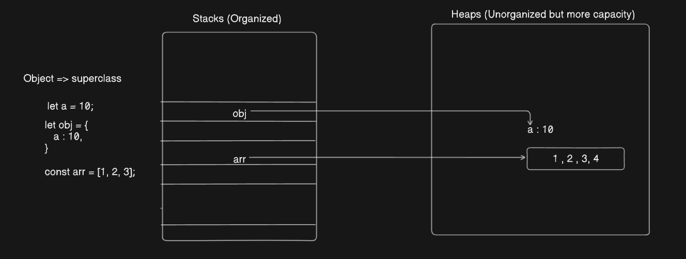

# Progamming in JS

## Index

1. What is programming?
2. How do programming languages came into picture?
3. What are the things you need in "any" programming language?
4. Types of Languages: Statically(Strictly) and Dynamically(Loosely) Typed
5. Types of Languages: Compiled(C, C++, Java Rust, etc.) and Interpreted(JS, Python etc.)
6. What constitutes JS(Hints regarding Runtimes)? => variables, loops(while, for, do-while), functions and arrays
7. Primitive and Non-Primitive Types in JS(along with variables)
8. Callbacks(Most Important: 30 mins)
9. Memory Management and Garbage Collectors

## Answers to the above questions:

1. Programming is the way to tell computers to do some processing(mathematics, physics, games etc.)/some task.
2. Well, how do humans communicate? Using some language so we devised programming languages to give
   instructions to the computer.
3. Variables, Conditionals & Boolean Operators, Functions, Loops, Arrays and Structs [C mein garbage collector nahin hai]
4. Statically Typed : Types(C, C++, Java; Types: int, bool, char, string) and Dynmically Typed :(Type Inference/No need
   of types of all)
5. Compiled = Compiler checks for errors and then converts them into executable(.exe, .dmg) that we run
   Interpreted = They are run line by line and stop execution when the file finishes/some error is encountered
6. Variables, Conditionals & Boolean Operators, Loops, Functions(function, anonymous, arrow, IIF) and Arrays: This is what JS is made of
7. Primitive and Non-Primitives
8. Callbacks are functions passed in other functions(Higher Order function) as a parameter.
9. Memory Management using Stack and Heap

## Here&apos;s a comparison table for **C** and **JavaScript** variables:

| **Feature**      | **C Language**           | **JavaScript** (Infers Types)                |
| ---------------- | ------------------------ | -------------------------------------------- |
| Integer          | `int a = 10;`            | `var a = 10;`                                |
| Floating Point   | `float f = 3.14159;`     | `var f = 3.14159;`                           |
| Double Precision | `double d = 2.31;`       | `var d = 2.31;`                              |
| Character        | `char c = 'd';`          | `var c = 'd';` or `var c = "d";`             |
| Boolean          | `bool b = true;`         | `var b = true;`                              |
| Array            | `int arr[] = {1, 2, 3};` | `var a = [1, 2, 3];`                         |
| String           | `char str[] = "Hello";`  | `var str = "Hello";` or `var str = 'Hello';` |

### Other ways of defining a variable in JS are:

- `let` and `const`

```js
var a = 10; // mutable
let b = 20; // mutable
b = 30;
a = 40;
const c = 69; // immutable
c = 100; // error
```

#### Preference for using these keywords:

```js
1. const
2. let
3. var // never
```

Things that can be done using 'let' can be done using 'var'.

```js
let k = 100;
k = "Priyanshu";
```

##### Types and values can be manipulated as well. This is the reason that Typescript is used.

## Types of Variables:

1. Primitive(which JS understands natively/stores in stack memory)
2. Non-Primitives(those are stored in Heap and are treated as Objects)

### Primitives

JS understands natively, meaning it categorizes the variables in these or else they are treated as objects(will be discussed later)

1. number
2. boolean
3. string
4. bigInt
5. undefined
6. symbol
7. null

### Non Primitives

The type of variables which are not primitives are **Non-Primitives** and are treated as objects.

## Loops:

1. for
2. while
3. do-while

```js
// For loop
for (let i = 0; i < 10; i++) {
  console.log(i);
  // console.log() is used to print things on terminal, just like printf in C.
}

// While loop:
let b = 10;
while (b > 0) {
  console.log(b);
  --b;
}

// do-while loop: runs atleast once
let c = -10;
do {
  console.log(c);
  --c;
} while (c > 0);
```

## Conditionals and operators:

- if-else, >, <, ==, ===, <=, >=

```js
let a = 10;
if (a > 10) {
  console.log("Hello");
} else if (a === 10) {
  console.log("a is", 10);
} else {
  console.log("World");
}
```

### Examples:

1. Check if a number is palindrome
2. Fibonacci printing
3. Armstrong Numbers
4. Factorial

## Arrays: A way to group data.

```js
const a = ["Priyanshu", 20, 7.6];

a.push(100); // it's for master

console.log(a[0]);

console.log(a[1]);

console.log(a[2]);

// To get the length of an array: a.length

// How to traverse an array?

for (let i = 0; i < a.length; i++) {
  console.log(a[i]);
}
```

## Strings: Sequence of characters

```js
const b = "Hello";

console.log(b[0]); // 'h'
// How to traverse a string?
for (let i = 0; i < b.length; i++) {
  console.log(b[i]);

  // print in single line => for master => process.stdout.write(b[i]);
}
```

## Functions:

- Definition: They are a way to group code and run them on demand.

- They are first class citizens in JS => for master.

```js
// Way 1: Copy-paste the below block of code everywhere you need them

console.log(10);

for (let i = 0; i < 10; i++) {
  console.log(i);
}

// Way 2: Make a function for it, group them together and then call it anywhere

function fun() {
  console.log(10);

  for (let i = 0; i < 10; i++) {
    console.log(i);
  }
}

fun(); // way to call/invoke a function
```

### Parameter in a function:

```js
function fun(a) {
  console.log(a);
}

let priyanshu = 100;
fun(priyanshu); // This will print 100.

// parameter can be literally anything: primitive or non-primitive and/or a function as well.

fun("Hello");

fun([1, 2, 3]);
```

### Other ways to define a function:

1. Using function keyword
2. Using let, const or var
3. Arrow functions
4. IIF(immediately invoked functions)

```js
// 1
function a() {
  console.log("Hello");
}

// 2
let b = function b() {
  console.log("Hello");
};

// 3
const c = () => {
  console.log("Hello");
};

// 4
(() => {
  console.log("Hello");
})();
```

## How to pass a function as a parameter?(Imp.)

```js
const param = (x) => {
  console.log(x);
};

let rand = Math.random(); // => gives a random value between 0(inclusive) to 1(exclusive);

function higherOrder(cb) {
  cb(rand);
}

higherOrder(2); // it will give an error, that 2 is not callable or not a function

higherOrder(param);
```

### What are higher order functions and callbacks?

### Difference between argument and parameter => for master.

## Ways to pass a callback: (Imp.)

1. By declaring them and passing them as a parameter
2. By passing their body as an argument, <u>when the higher order function is called</u>.
   ```js
   // 1
   higherOrder(function a(x) {
     console.log(x);
   });
   // 2
   higherOrder(function (x) {
     console.log(x);
   });
   // 3
   higherOrder((x) => console.log(x));
   ```

# Memory Management (Stacks and Queues)

- Memory &rarr; R.A.M. , Storage &rarr; SSD, HDD

- Stacks and Queues are software based data structures, in hardwre there are literal blocks of memory and nothing like this, they are just indexed.


